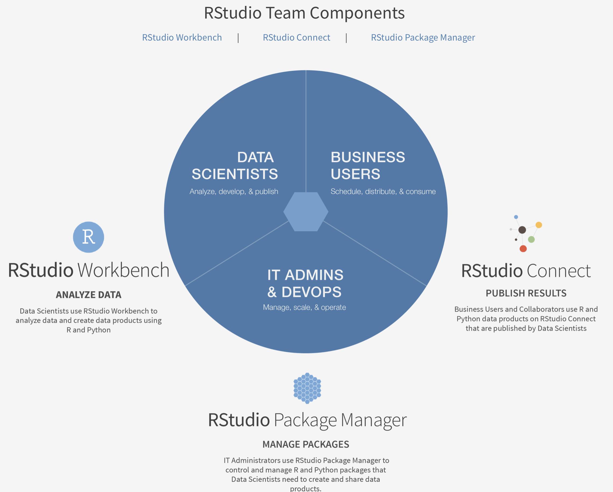
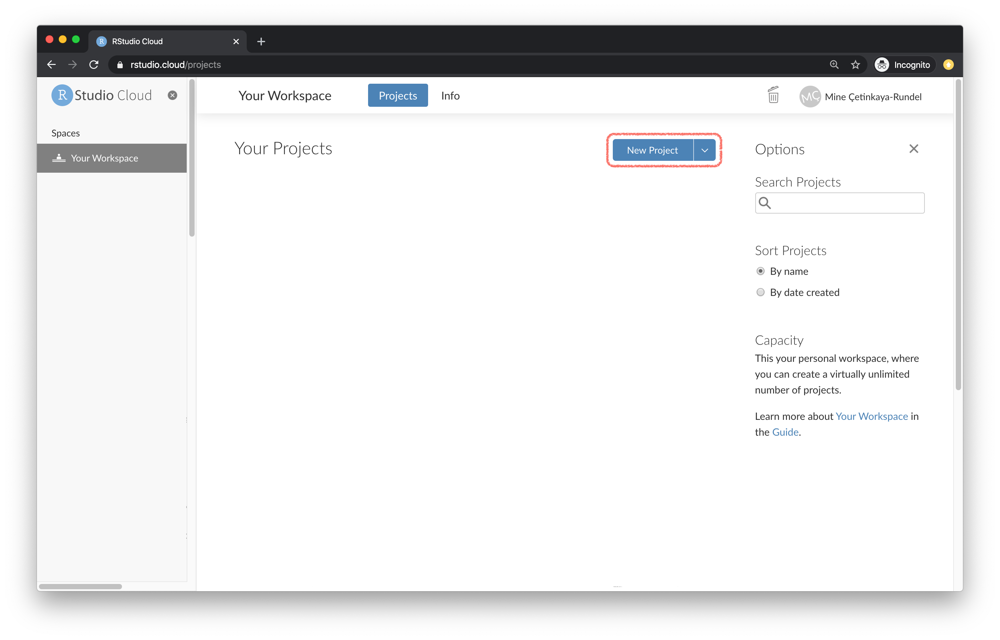

```{r child = "../setup.Rmd"}
```

```{r xaringan-themer, include=FALSE, warning=FALSE}
library(xaringanthemer)
library(xaringanExtra)
library(fontawesome)
library(tidyverse)
use_tile_view()
use_webcam()
use_panelset()
style_mono_accent(
  base_color = "#1c5253",
  header_font_google = google_font("Josefin Sans"),
  text_font_google   = google_font("Montserrat", "300", "300i"),
  code_font_google   = google_font("Fira Mono")
  )
library(RefManageR)
BibOptions(check.entries = FALSE,
           bib.style = "authoryear",
           cite.style = "alphabetic",
           style = "markdown",
           hyperlink = FALSE,
           dashed = FALSE)
myBib <- ReadBib("biblio.bib", check = FALSE)
```


# Outline
.salt[
- Credibility and relevance in teaching (WHY)
- Rethinking statistical inference (WHY)
- Examples in finance (WHY)
- Open science analytics (HOW)
- Our Tech Stack (Q-RaP) (HOW)
- What is Q-RaP? (HOW)
- Why use Q-RaP? (HOW and WHY)
- Some examples in my teaching (HOW)
]

---
class: middle

# Credibility and relevance crisis

- Relevance and quality of research in business schools has been under attack for more than two decades. (Hambrick 1994, Harvey 2017)

([Responsible Research for Business and Management 2020 Position Paper](https://www.rrbm.network/position-paper/)) argues:

- .large[CREDIBILITY:]<br> Research quality and integrity are under attack as evaluation systems promote bad research practices encouraging novelty over replicability.
- .blockquote[Responsible research, using open science principles, can provide useful and credible knowledge.]

- .large[RELEVANCE:] <br>Research feeds knowledge to business education, yet there is a widening gap between research and practice.


.footnote[Don Hambrick’s (1994) presidential address at the 1993 Academy of Management’s annual meeting is often cited as the beginning of this conversation in the management field]

---
class: middle

# Start of WHY

- Go to [HOW content](#how-content)

.huge-text[Somewhere, something *incredible* is waiting to be known `r tufte::quote_footer('Carl Sargan')`]

.large[In finance, we need a .glowinline[reboot] of analytics towards a *credible* statistics toolkit]

.hand[FinTech offers an opportunity to reshaping how we learning from *noisy* financial data, by placing computation and uncertainty estimation as the central tenet of finance curricula]

---
class: middle

## Moving from computation to inference

- To move from computation to inference in statistics, we must make an estimation choice.  

- Mathematical statistics is the science of learning from experience that arrives a little at a time [@Efron2016] 

- Then using this information to quantify uncertainty and variation[@Spiegelhalter2019]. 

- Unlike many other disciplines in mathematics, there is no unifying theory. 
- Credible inference from statistics requires careful thought beyond the computing algorithm. 
- The modern financial data scientist is faced with two abstracting *leaps of faith* to go from computation to credible inference.

---
class: middle

# The leaps of faith!

- The theoretical inference paradigms are Classical (or frequentist) and Bayesian

.blockquote[Roughly speaking, frequentists infer meaning by asking themselves *what would I see if I reran the same situation (and again and again and again,..., ad infinitum, et ultra)?* ]

.blockquote[
On the other hand, bayesian coax a fantastical belief that *they have prior knowledge of the situation, encode this in probability, and update this knowledge by learning from a set of observed data points*.]

- .hand[In essence, one needs to be somewhat of a fantasist to generalise from statistical measurement.]

---
class: middle

# Rethinking Statistical Inference

- We use statistical inference when we want to learn from incomplete or imperfect data. 

- Formally, statistical inference is a set of operations on data that yield estimates and uncertainty statements about predictions and parameters of some underlying process or population.  

- Mathematically, these probabilistic uncertainty statements are derived based on some assumed probability model for observed data.

- Understanding errors in statistical work depends on inferential statements built on the concepts of probability modelling, estimation, bias and variance. 

- A central theme in modern statistical inference is uncertainty. 

- Mainstream statistics has long argued that it is a mistake to use hypothesis tests or statistical significance to attribute certainty from noisy data [@ASApvalues.2016;@Campbell.2017,@Gelman2020].

<!-- --- -->
<!-- class: middle -->

<!-- ## Simple uncertainty and computation exercise -->

<!-- .panelset[ -->
<!-- .panel[ -->
<!-- .panel-name[Hypothetical example of regression for causal inference] -->
<!-- - Start with a simple scenario comparing treatment and control groups.   -->
<!-- - This condition can be approximated by *randomisation*, a design in which experimental units (in finance we can think of these a firms) are randomly assigned to treatment or control. -->
<!-- - Consider the following hypothetical example where $x$ is a random market shock (the treatment) affecting only certain firms in the UK market (x=0 for control or x=1 for treatment) -->
<!-- ] -->
<!-- .panel[.panel-name[Fake data] -->

<!-- ```{r} -->
<!-- N <- 50 -->
<!-- x <- runif(N, 1, 5) -->
<!-- y <- rnorm(N, 10 + 3*x, 3) -->
<!-- x_binary <- ifelse(x<3, 0, 1) -->
<!-- data <- data.frame(N, x, y, x_binary) -->
<!-- lm_1a<-lm(y~x_binary,data) -->
<!-- ``` -->
<!-- ] -->

<!-- .panel[.panel-name[Open science output] -->

<!-- - The display function from `arm` purposefully removes the visualising of p-values. -->

<!-- ```{r,o} -->
<!-- library(arm) -->
<!-- lm_1b <- lm(y ~ x, data = data) -->
<!-- display(lm_1b) -->
<!-- ``` -->

<!-- ] -->
<!-- .panel[.panel-name[Visualise data and model] -->

<!-- ```{r, echo=FALSE} -->
<!-- data %>% -->
<!--   ggplot(aes(x=x,y=y)) + -->
<!--   geom_point() + -->
<!--   geom_smooth(method = "lm", se = FALSE) + -->
<!--   labs(x="Treatment level", y="Outcome measurement",title="Regression with continuous treatment") + -->
<!--   geom_text( aes(x=3.2,y=15,label=paste("Estimated treatment\neffect per unit of x is\nslope of fitted line: ", fround(coef(lm_1b)[2], 1)), -->
<!--             parse = TRUE)) -->

<!-- ``` -->
<!-- ] -->
<!-- .panel[.panel-name[Bayesian inference] -->
<!-- ```{r bayesian} -->
<!-- library(rstanarm) -->
<!-- library(bayesplot) -->
<!-- library(tidyverse) -->
<!-- options(mc.cores = parallel::detectCores()) -->
<!-- m1<-stan_glm(y~x,data=data,algorithm='optimizing') -->
<!-- ``` -->
<!-- ] -->
<!-- .panel[.panel-name[Bayesian regression output] -->


<!-- ```{r, out.height="50%"} -->
<!-- summary(m1, digits = 2) -->
<!-- ``` -->

<!-- ] -->
<!-- .panel[.panel-name[Plotting the uncertainty] -->
<!-- ```{r echo=FALSE} -->
<!-- posterior <- as.matrix(m1) -->
<!-- plot_title <- ggtitle("Posterior distributions", -->
<!--                       "with medians and 80% intervals") -->
<!-- mcmc_areas(posterior, -->
<!--            pars = c("x"), -->
<!--            prob = 0.8) + plot_title -->
<!-- ``` -->

<!-- ] -->
<!-- ] -->

---
class: middle

## Rethinking Statistical Inference:

.hand[when building interpreting and checking statistical models]

* Model building, starting with simple linear models of the form, $y=a+bx+error$ and expanding through additional predictors, interactions, and transformations.

* Model fitting, which includes data manipulation, programming, and the use of algorithms to estimate regression coefficients and their uncertainties and to make probabilistic predictions.

* Understanding model fits, which involves graphics, more programming, and an active investigation of the (imperfect) connections between measurements, parameters, and the underlying objects of study.

* Criticism, which is not just about finding flaws and identifying questionable assumptions, but is also about considering directions for improvement of models. Or, if nothing else, limiting the claims that might be made by a naive reading of a fitted model.

* The next step is to return to the model-building step, possibly incorporating new data in this effort. 

---
class: middle

## Rethining statistical inference: 

.hand[Modelling paradigm choices]

- Most finance puzzle fit models to data and uses model to predict  [@Kelly.2021].
- There are three concerns common to all all steps in this framework

1. What **information** is used in the estimation process
2. What **assumptions** are made
3. How estimates and predictions are **interpretted**, in a Classical or Bayesian framework
]

---
class: middle

## Information

- In regressions we usually have data on an outcome variable and one of more predictors. 
- As we seen previous if we have one $x$ predictor or one binary and one continuous predictor we have visual their relationship with the outcome $y$ variable
- In finance we will also have information on what data was observed
  - Is the data measured on a regular frequency? 
  - Is the data free from survivor bias?
  - Is the data a random or convenience sample?


---
class: middle

### Prior information *learning from experience*

- We may also have *prior knowledge* comes from sources other than the data, based on experience with previous or similar studies. 
- This information should be handled with care, as published research tends to overestimate effect sizes
- This is due to researchers being under pressure to find large and *statistically significant* results
- There are setting when local data is weak and it would be foolish to draw conclusions without using prior knowledge

---
class: middle

## Assumptions

1. For example, the function form of the model; typically **linearity** in mainstream finance.
2. Where does the data come from: which potential observations are seen and which are not. A strong assumption here would be that there has been random sampling or random treatment assignment. In finance random sampling is raw.
3. The real-world relevance of the measured data; for example are today's measurements predictive of of what happens tomorrow?. 
- .acidinline[In time series financial econometrics we assess this statistically by comparing the stability of observations conducted in different ways or at different times.]

---
class: middle

# Classical inference

- Based on summarising the information in the data alone, not using prior information. 
- Getting estimates and predictions that have well-known statistical properties, low bias and low variance.
- This attitude is sometimes called *Frequentist*, in that classical statisticians focus on the long-run expectation of their methods.
- Estimates should be correct on average; **unbiasedness**.
- Confidence intervals should cover the true parameter value 95% of the time
- An important principle of classical estimates is *conversatism*.
- In classical statistics there should be a clear and *objective* path from data to inference, which in turn should be checkable, at least in theory, based on their frequency properties.

---
class: middle

# Bayesian inference

- Goes beyond summarising data to produce statistical inferences that include prior information.
- This information could be awareness of bias, selection on unmeasured characteristics, prior information of effect sizes.
- One strength of Bayesian inference, the analysis can provide more reasonable inferences and can be used to make direct predictions about future outcomes.
- One weakness is the need for an additional information; the **prior distribution**, which can be contentious in that it makes some claims about the range of the prediction effects.

---
class: middle

## Rethinking statistical inference

.hand[The choice]

- Classical inference, leading to pure summaries of data which can have limited value as predictions
- Bayesian inference, which in theory can yield valid predictions even with weak data, but relies on additional assumptions

- .acidinline[A modern financial data scientist, knows there is no universally correct choice, but should be aware of both and use them pragmatically.]

- A practical advantage of Bayesian inference is that all inferences are probabilistic and thus can be represented by random simulations.

- For this reason when you want to summarise uncertainty in estimation beyond confidence intervals, and when we want to use regression models for prediction, **going Bayesian is an obvious choice**.


---
class: middle

# Rethinking statistical inference in finance

.large[
1. .Bollerslev, T., Li, J. & Liao, Z. Fixed‐k inference for volatility. Quant Econ 12, 1053–1084 (2021).
  


2. Jensen, T. I., Kelly, B. T. & Pedersen, L. H. Is There a Replication Crisis in Finance? Ssrn Electron J (2021) doi:10.2139/ssrn.3774514.
  
]


---
class: middle
name: how-content

# Open science

.hand[Open Science is about increasing rigour, accountability and reproducibility for research]

.blockquote[
Open Science is the practice of science in such a way that others can collaborate and contribute, where research data, lab notes and other research processes are freely available, under terms that enable reuse, redistribution and reproduction of the research and its underlying data and methods. 
]
<br>
.blockquote[
In a nutshell, Open Science is transparent and accessible knowledge that is shared and developed through collaborative networks (Vicente-Sáez & Martínez-Fuentes 2018).
]

.footnote[[Open Science Training Handbook 2020](https://open-science-training-handbook.gitbook.io/book/open-science-basics/open-concepts-and-principles)]

---
class: inverse

# Open science analytics

.pull-left-1[
.huge-text[Goals]
]

.pull-right-2[
1.  Produce interesting output with data (and code) within the first ten minutes of the first class, 
  - The knock-on effect is to challenge students to infer meaning from data and statistics from day one.
  
2. Get students to think about computation as an integral part of their analytics curriculum[@Kaplan2007; @Cetinkaya-Rundel2018;@Quinn2022]

3. Demystify the [folk theorem of statistical computing](https://statmodeling.stat.columbia.edu/2008/05/13/the_folk_theore/) 
4. Produce relevance students

5. Computation as a friction less part of curricula
6. Active learning from mistakes 

7. Growth mindset learning
]

---
class: middle

## Active learning and the 15 minute rule

<iframe width="560" height="315" src="https://www.youtube.com/embed/ZS8QHRtzcPg" title="YouTube video player" frameborder="0" allow="accelerometer; autoplay; clipboard-write; encrypted-media; gyroscope; picture-in-picture" allowfullscreen></iframe>

  - We will use the **15 minute** rule in this class.
  - If you encounter problems, spend 15 minutes troubleshooting on your own.
  - Make use of Google and StackOverflow to resolve the error
  - If your problem is not resolved after 15 minutes.
  - Use my Slack channel to **[ask for help]**. join [here](https://join.slack.com/t/rethinkingeco-3ss9716/shared_invite/zt-12nfdfr7o-XAy2Ef1knAKXgUNo2kWw3w) 


---
class: middle

# Open science analytics

.pull-left[
.salt[Principles]
- Experiential learning (brake it to learn it)
- Embedding real-world practice
- Analytics integrity
- Culture of curiosity (not competition)
- Literate programming ([Knuth (1992)](https://www-cs-faculty.stanford.edu/~knuth/lp.html))
]
.pull-right[
.acid[Teaching environment toolkit]
- Open source software 
- `r fa(name='r-project',fill='blue')` `r fa(name='plus')` `r fa(name='python',fill='blue')` `r fa(name='plus')` `r fa(name='terminal',fill='blue')`
- Cloud computing
- Version control
- Computational notebook
- Web apps
- Simulation (fake it before you make it)
]

---
class: middle

# Cost of open science analytics

- Upskill and reskill colleagues
- Resistance from higher ups
- IT and DevOps support
- ?????

---
class: middle

.huge-text[What is Q-RaP?]

--

### Qms-Remote analytics Platform

--
.acid[It consists of two parts]
.pull-left[
**Advanced Teaching and Research**
- High-Performance Cloud Computing Suite
- Hosted in Azure
- Managed by [QMS DevOps Team](https://quinference.com)
- For Advanced Analytics at PGT and PGR level
- Analytics platform
- Visualisation platform
- Access on approval form
]
.pull-right[
**Foundational Teaching**
- RStudio Cloud (200+ students concurrently)
- 2022 semester two analytics modules on the masters
  ]

---
class: middle

## Examples of use

.pull-left[

]

.pull-right[

[https://q-rap.connect.qub.ac.uk/QSMF/](https://q-rap.connect.qub.ac.uk/QSMF/)

<iframe width="100%" height="400"
  src="https://q-rap.connect.qub.ac.uk/QSMF"
  frameborder="0" allow="autoplay; encrypted-media"
  allowfullscreen></iframe>
]

---
class: middle

## Examples of foundational use

   

---
class: middle

## Infrastructure 

.pull-left.blockquote[
- RStudio Team is a bundle of RStudio's enterprise-grade professional software for scaling data science analytical work across your team, sharing data science results with your key stakeholders, and managing R and Python packages. 


- RStudio Team includes RStudio Workbench, RStudio Package Manager, and RStudio Connect.  RStudio Team offers convenience, simplicity, and savings to organisations using R, Python and RStudio at scale. 

- Free to academia for teaching

- Allows best practice usage of Rmarkdown, Git and dockerisation.
]
.pull-right[

]
---
class: middle

# What is wrong with computer labs?

.large[

Compared to the computer labs approach, our approach has three distinct benefits:
1. Passive lecturing then active labs are replaced by dynamic lectures and labs and 24/7 access to computing for active independent learning;
2. Help students who have cost constraints or limitation to accessing computing hardware;
3. Ease of sharing code, data and environments.

]

---
class: middle

.pull-left[
### you used to have this
```{r computer-lab, echo=FALSE, out.width="70%"}
knitr::include_graphics("img/jonathan-borba-PZBjJ12Xv2s-unsplash.jpg")
```
]
--
.pull-right[
### and now you have this
```{r laptop-at-home, echo=FALSE, out.width="80%"}
knitr::include_graphics("img/sincerely-media-o5Key-1HzaY-unsplash.jpg")
```
]

.footnote[
.tiny[Photos by Jonathan Borba and Sincerely Media on Unsplash.]
]
---
class: middle

.pull-left[
  .huge-text[Why]
]
.pull-right[
  .larger[
  RStudio  
  in the cloud?
  ]
]


---
class: middle

.pull-left[
### lots of friction points

- Install R
- Install RStudio
- Install the following packages:
  - rmarkdown
  - tidyverse 
  - ...
- Load these packages
- Install git
]

.pull-right[
### much less friction

- Go to rstudio.cloud
- Log in

```{r hello-r, eval=FALSE}
>hello R!
```
]

---
class: middle

.pull-left[
  .huge-text[How]
]
.pull-right[
  .larger[
  RStudio  
  in the cloud?
  ]
]

---
class: middle

.pull-left[
- .acid[RStudio Workbench (Advanced teaching)]
You have...
- sysadmin experience / IT support
- hardware / local VM / cloud computing credit
- RStudio experience
]
.pull-right[
- .acid[RStudio Cloud]

You have...
- RStudio experience
]


---
class: middle

.pull-left[
  .huge-text[Hello]
]
.pull-right[
  .larger[
  Q-RaP
  RStudio  
  Cloud
  ]
]

---
class: middle

## What is RStudio Cloud?

<br>

.pull-left-narrow[
```{r echo=FALSE}
knitr::include_graphics("img/cloud.png")
```
]
.pull-right-wide[
.large[[**RStudio Cloud**](https://rstudio.cloud/) created to make it easy for professionals, hobbyists, trainers, teachers, and students to do, share, teach, and learn data science using R.]
]

---
class: middle

.center[
```{r echo=FALSE, out.width="80%"}
knitr::include_graphics("img/rstudio-ide.png")
```
]

---
class: middle

.center[
```{r echo=FALSE, out.width="80%"}
knitr::include_graphics("img/rstudio-cloud.png")
```
]

---
class: middle

## Why RStudio Cloud?

- Does not require IT support

--
- Git works out of the box
- Knit to PDF and Word works out of the box

--
- Features designed for instructors

---
class: middle

## Contexts

- Shorter workshops: Likely no opportunity to communicate pre-workshop instructions, varied computing background and learning goals

- Semester long courses
  - Intro data science / statistics: little to no background in stats, data science, programming
  - Upper level data science / statistics: Varied computing background and different computer setups

---
class: middle

## RStudio Cloud: First look

```{r echo=FALSE, out.width="80%", fig.align="center"}
knitr::include_graphics("img/landing-1.png")
```

---
class: middle

## Workspaces

- When you create an account on RStudio Cloud you get a workspace of your own

- You can add a new workspace and control its permissions

- Projects in either workspace can be public or private

---
class: middle

## A framework for workspaces

```{r echo=FALSE, out.width="90%", fig.align="center"}
knitr::include_graphics("img/landing-2.png")
```

---
class: middle

## Projects

.pull-left[
A new project in RStudio Cloud
```{r echo=FALSE, out.width="90%", fig.align="center"}

```
]
.pull-right[
is a new project in RStudio IDE
```{r echo=FALSE, out.width="90%", fig.align="center"}
knitr::include_graphics("img/new-project-local.png")
```
]

.alert[
**Top Tip:** If you use RStudio, use projects! Trust me, you won’t regret it. Find out more on [R for Data Science](https://r4ds.had.co.nz/workflow-projects.html).
]

---
class: middle

# Computational Notebooks
- Computational notebooks are documents that combine code, discussion and output in a dynamic reproducible format. 
- An essential advantage of computational notebooks is that they embody the PPDAC credible analysis workflow (Problem, Plan, Data, Analysis, Communication). 
- PPDAC is the professional standard for data analysis and plausible inference[@Spiegelhalter2019].
- Unlike the copy and paste approach, all five parts of the PPDAC approach can be included in one document, providing an enhanced level of transparency, portability and reproducibility.


---
class:middle

## Git and GitHub

.pull-left[
```{r echo=FALSE, out.width="25%"}
knitr::include_graphics("img/git-logo.png")
```
- Git is a version control system -- like “Track Changes” features from Microsoft Word, on steroids
- It's not the only version control system, but it's a very popular one
]
.pull-right[
```{r echo=FALSE, out.width="25%"}

```
- GitHub is the home for your Git-based projects on the internet -- like DropBox but much, much better

- We will use GitHub as a platform for web hosting and collaboration (and as our course management system!)
]

---
class: middle

## Versioning

```{r echo=FALSE, fig.align = "center", out.width = "70%"}
knitr::include_graphics("img/lego-steps.png")
```

---
class: middle

## Versioning 

### with human readable messages

```{r echo=FALSE, fig.align = "center", out.width = "60%"}
knitr::include_graphics("img/lego-steps-commit-messages.png")
```

---
class: middle

## Why do we need version control?

```{r echo=FALSE, fig.align = "center", out.width="35%"}
knitr::include_graphics("img/phd_comics_vc.gif")
```

---
class: middle

## How will we use Git and GitHub?

```{r echo=FALSE, out.width="100%"}
knitr::include_graphics("img/whole-game-01.png")
```

---
class: middle

## How will we use Git and GitHub?

```{r echo=FALSE, out.width="100%"}
knitr::include_graphics("img/whole-game-02.png")
```

---
class: middle

## How will we use Git and GitHub?

```{r echo=FALSE, out.width="100%"}
knitr::include_graphics("img/whole-game-03.png")
```

---
class: middle

## How will we use Git and GitHub?

```{r echo=FALSE, out.width="100%"}
knitr::include_graphics("img/whole-game-04.png")
```

---
class: middle

# Git and GitHub tips

- There are millions of git commands -- ok, that's an exaggeration, but there are a lot of them -- and very few people know them all. 99% of the time you will use git to add, commit, push, and pull.

--
- We will be doing Git things and interfacing with GitHub through RStudio, but if you google for help you might come across methods for doing these things in the command line -- skip that and move on to the next resource unless you feel comfortable trying it out.

--
- There is a great resource for working with git and R: [happygitwithr.com](http://happygitwithr.com/). Some of the content in there is beyond the scope of this course, but it's a good place to look for help.

---
class: middle

.hand-large[thank you! <br>Questions?]

- All my material can be found at https://github/quinfer/open-science-analytics

- .hand[My Jerry Maguire Moment:]

.blockquote[Quinn, B. Teaching open science analytics in the age of financial technology. QMS Working Paper Series (Under Review at Journal of International Financial Markets, Institutions and Money ) (2022) doi:10.2139/ssrn.4019430.]
  

